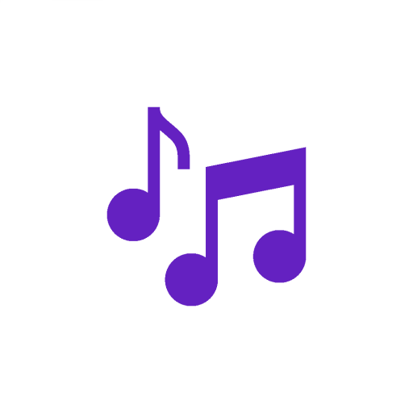
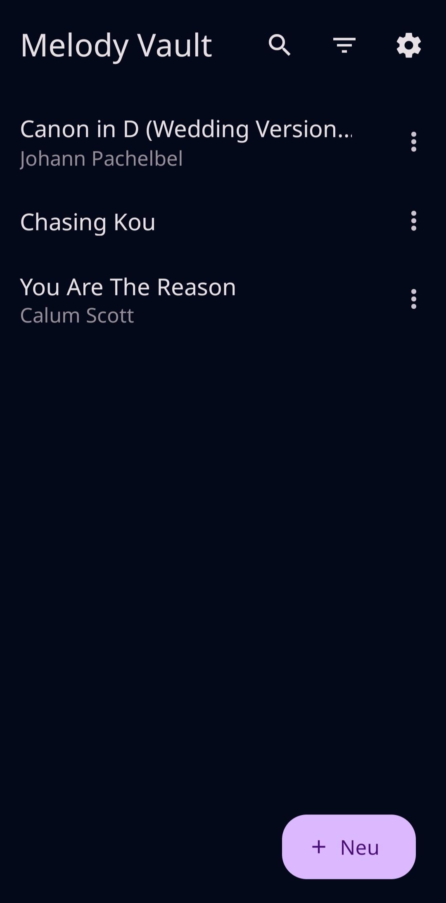
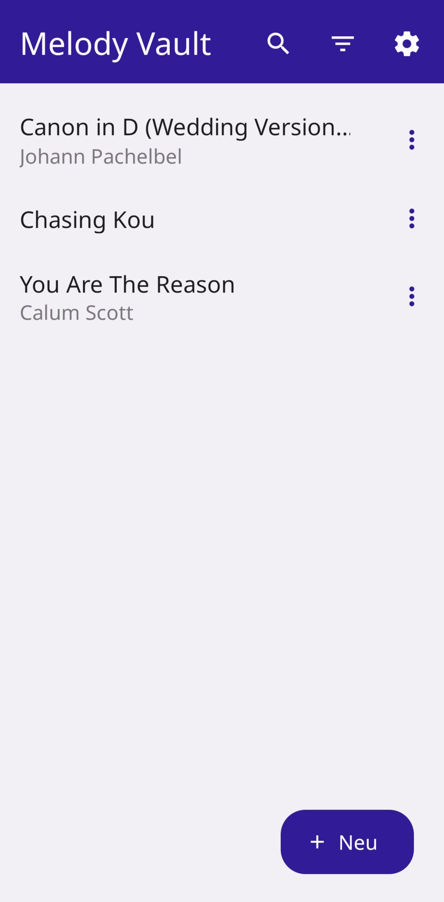
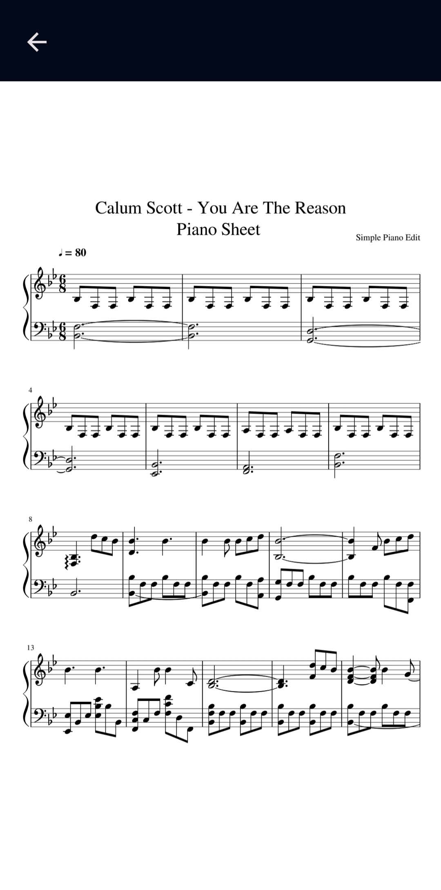
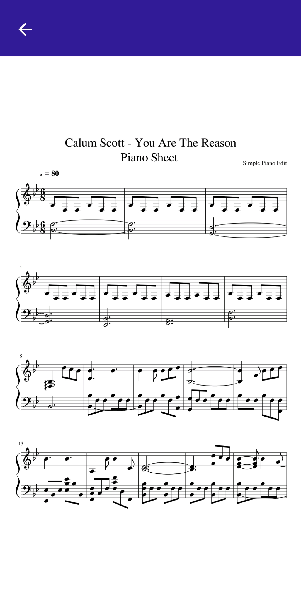

  
  
  

 

  

  <h3 align="center">Melody Vault</h3>

  

    Your personal digital library for sheet music
     
    <a href="https://github.com/Terrorknubbel/melody_vault/issues/new?labels=bug&template=bug-report---.md">Report Bug</a>
    ·
    <a href="https://github.com/Terrorknubbel/melody_vault/issues/new?labels=enhancement&template=feature-request---.md">Request Feature</a>
  

  
Table of Contents

  <ol>
    <li><a href="#about-the-project">About The Project</a></li>
    <li><a href="#screenshots">Screenshots</a></li>
    <li><a href="#built-with">Built With</a></li>
    <li><a href="#roadmap">Roadmap</a></li>
    <li><a href="#contributing">Contributing</a></li>
    <li><a href="#license">License</a></li>
    <li><a href="#contact">Contact</a></li>
  </ol>

## About The Project

In the vast symphony of music storage apps, none struck the right chord for my needs. That's why I developed Melody Vault – an app designed to be the definitive solution for organizing and viewing your sheet music. Melody Vault aims to provide an intuitive and powerful experience, ensuring it becomes the ultimate tool for your sheet music collection.

Benefits:
* 🆓 Completely ad-free and open source, now and forever
* 🧭 User-friendly interface for easy navigation
* 📂 Quick access to all your musical scores
* 🌗  Support for both dark and light mode
* 📱 Fully tablet-compatible for a larger viewing experience

## Screenshots

  

    
    
  

  

    
    
  

(<a href="#readme-top">back to top</a>)

### Built With

* 
* 
* 
* 
* 
* 
* 
* 

(<a href="#readme-top">back to top</a>)

## Roadmap

- [x] Full Theme Support
- [x] Document Scanning
- [x] Tablet-compatibility
- [ ] Multi-language Support
    - [ ] English
- [ ] PDF annotations
- [ ] Google authentication
- [ ] Sheet Sync/Upload

See the [open issues](https://github.com/othneildrew/Best-README-Template/issues) for a full list of proposed features (and known issues).

(<a href="#readme-top">back to top</a>)

## Contributing

Any contributions you make are **greatly appreciated**.

If you have a suggestion that would make this better, please fork the repo and create a pull request. You can also simply open an issue with the tag "enhancement".
Don't forget to give the project a star! Thanks again!

1. Fork the Project
2. Create your Feature Branch (`git checkout -b feature/AmazingFeature`)
3. Commit your Changes (`git commit -m 'Add some AmazingFeature'`)
4. Push to the Branch (`git push origin feature/AmazingFeature`)
5. Open a Pull Request

(<a href="#readme-top">back to top</a>)

## License

Distributed under the GPLv3 License. See `LICENSE` for more information.

(<a href="#readme-top">back to top</a>)

## Contact

Wolfgang Macher - w.macher3@gmail.com

Project Link: [https://github.com/Terrorknubbel/melody_vault](https://github.com/Terrorknubbel/melody_vault)

(<a href="#readme-top">back to top</a>)

